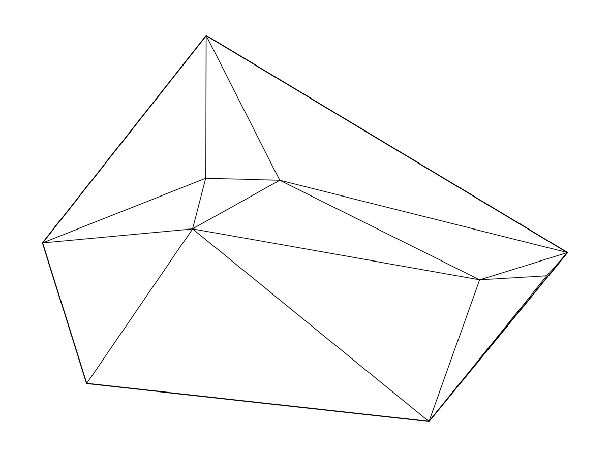
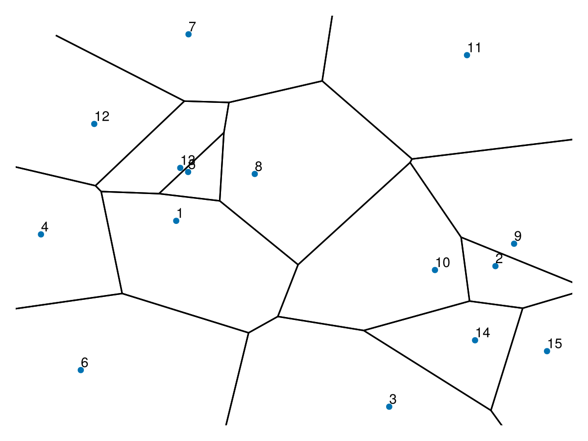

# Delaunator

[](https://juliageometry.github.io/Delaunator.jl/stable)
[](https://juliageometry.github.io/Delaunator.jl/dev)
[](https://codecov.io/gh/juliageometry/Delaunator.jl)
[](https://coveralls.io/github/juliageometry/Delaunator.jl?branch=master)

A port of [Mapbox's Delaunator](https://github.com/mapbox/delaunator) to Julia.

> An incredibly fast and robust Javascript library for
> [Delaunay triangulation](https://en.wikipedia.org/wiki/Delaunay_triangulation) of 2D points.

The Delaunator algorithm computes a simple 2d triangulation of an arbitrary set of points in the plane _quickly_. This package provides a Julia implementation of the algorithm along with a number of supporting routines that operate on the Delaunator data structures. 

On a 2020 M1 Macbook Air, the `Delaunator.jl` package will triangulate a million points in about 500ms, including computing circumcenters for the triangles for the closest site diagram. 

```julia
using GeometryBasics, Delaunator, StableRNGs, CairoMakie, Statistics, LinearAlgebra

# generate random points. 
ipts = randn(StableRNG(1), ComplexF64, 100)
ipts = sqrt.(abs.(ipts)).*ipts./abs.(ipts)
pts = Point2f.(zip(real(ipts),imag(ipts)))
t = triangulate(pts) # triangulate them! 
f = Figure()
ax = Axis(f[1,1])
hidespines!(ax); hidedecorations!(ax) 
rdata = rand(StableRNG(1), length(triangles(t)))
# work over all triangles
for (i,tri) in enumerate(triangles(t))
  tripts = pts[collect(tri)]
  poly!(ax, tripts, color=norm(mean(tripts))*(1+0.5*rdata[i])*[1,1,1],
    colorrange=(0,3), 
    colormap=map(c->RGBAf(c.r,c.g,c.b,0.9), Makie.to_colormap(:matter)))
end
scatter!(ax, pts, color=:black, markersize=5)
f
```


Synopsis
--------
```julia
using Delaunator, GeometryBasics, StableRNGs
t = triangulate(rand(StableRNG(1), Point2f, 10))
for i in eachindex(t) # iterate over each point index 
  @show i, inhull(t, i) # this gives 0 or a pointer into t.hull
end
##  
for n in neighbors(t, 1) # iterate over neighbors of i
end 
for (i,j) in edges(t) # iterate over all edges in triangulation
end 

##
collect(triangles(t, 1)) # get the triangles that touch point 1.
```

```
(i, inhull(t, i)) = (1, 0)
(i, inhull(t, i)) = (2, 0)
(i, inhull(t, i)) = (3, 2)
(i, inhull(t, i)) = (4, 4)
(i, inhull(t, i)) = (5, 0)
(i, inhull(t, i)) = (6, 3)
(i, inhull(t, i)) = (7, 5)
(i, inhull(t, i)) = (8, 0)
(i, inhull(t, i)) = (9, 1)
(i, inhull(t, i)) = (10, 0)
6-element Vector{Int32}:
  3
  4
  7
 11
 10
  6
```


### Drawing the triangulation 
```julia
using CairoMakie
f = linesegments(collect(edgelines(t)), color=:black, linewidth=0.75) # draw the edges 
hidespines!(f.axis); hidedecorations!(f.axis) 
poly!(f.axis, collect(hullpoly(t)), color=:transparent, strokewidth=1); f
```




### Dual cells, aka Voronoi cells 
```julia
## dual cells, aka Voronoi cells (this interface is still a bit rough)
# get an infinite poly description of the points nearest cell i 
p = dualcell(t, 9) 
@show contains(p, (1.0,2.0)) # test if a point (x,y) is in the polygon
@show isfinite(p) # test if it's finite or infinite 
bbox = margin_bbox(t, 0.05) 
cp = clippedpoly(p, bbox) # produce a finite polygon
poly!(f.axis, cp, color=Cycled(1), strokewidth=1)
poly!(f.axis, clippedpoly(dualcell(t, 1), bbox), color=Cycled(2), strokewidth=1)
f
```

```
contains(p, (1.0, 2.0)) = false
isfinite(p) = false
```


Example uses
------------
```julia
# Draw the key edges in the dual cells of a triangulation, aka the Voronoi diagram
pts = rand(StableRNG(1), Point2f, 15)
rval = triangulate(pts)
f = scatter(pts); hidespines!(f.axis); hidedecorations!(f.axis) 
text!(f.axis, pts, text=map(i->"$i", 1:length(pts)))
for i in eachindex(rval) 
  local p = Delaunator.dualcell(rval, i)
  # use clipped poly to get closed polygons
  # for the dualcells... 
  linesegments!(f.axis, collect(segments(p)),
    xautolimits=false,yautolimits=false, color=:black)
end 
f
```




Philosophy
----------
When possible, everything is lazy and returns iterators and generators instead of arrays. 
Put simply: if you could have implemented something without copies / output arrays, we'd 
like to make it possible to do the same thing. Sometimes this is really tricky, like with
the `clippedpoly` scenario. So there, we allow you to provide any data type you want
to consume the points we are adding. This would enable one to implement something like
an area computation without any allocations. 

In the future
-------------
In the future, we hope to make things like this work! 
```julia
## Searching (NOT IMPLEMENTED)
findtriangle(t, pt) 
nearestpoint(t, pt) 

## nearest point cell diagram aka Voronoi diagram. (NOT IMPLEMENTED)
# you can get much of this with the "dualcell/clippedpoly" featuers
# this will compute and store the info in a more compact way. 
bc = boundedcells(t; margin=0.05) # get the nearest point cells
cellarea(bc, i)
cellpoly(bc, i) 
neighbors(bc, i) # get an iterator over neighbors of the bounded cells
```


Want to help?
-------------
- implement the searching routines "findtriangle" and "nearestpoint"
- use of `ExactPredicates.jl` to get better results on the robustness test cases 
- use the new Julia 1.9 package extensions to implement plotting routines for Makie/Plots.jl

Comparison to other packages
----------------------------

There are a variety of other Delaunay and Voronoi packages in the Julia ecosystem.

- [`VoronoiDelaunay.jl`](https://github.com/JuliaGeometry/VoronoiDelaunay.jl)
- [`VoronoiCells.jl`](https://github.com/JuliaGeometry/VoronoiCells.jl)
- [`DelaunayTriangulation.jl`](https://github.com/JuliaGeometry/DelaunayTriangulation.jl)
- [`MiniQhull.jl`](https://github.com/gridap/MiniQhull.jl)
- [`DirectQhull.jl`](https://github.com/JuhaHeiskala/DirectQhull.jl)

Both MiniQhull and DirectQhull wrap the Qhull binary library. This is extremely accurate but is much slower
than many other methods. 

The others are pure Julia packages. 
- `VoronoiDelaunay.jl` uses the [`GeometricalPredicates.jl`](https://github.com/JuliaGeometry/GeometricalPredicates.jl)
to ensure accurate geometry. This package then imposes a restriction of points to the interval [1,2] to guarantee accuracy
of floating point computations. 
- There is limited support for dual cells / Voronoi cells in `VoronoiDelaunay` and 
a good deal of this functionality is provided by the package `VoronoiCells.jl`. 
- The `DelaunayTriangulation.jl` package that 
uses [`AdaptivePredicates.jl`](https://github.com/JuliaGeometry/AdaptivePredicates.jl) and [`ExactPredicates.jl`](https://github.com/lairez/ExactPredicates.jl) to implement various 
computational geometry tests. This package is under active development and implements a number of methods for unconstrained and constrained Delaunay triangulations and Voronoi tessellations.

In comparison, the `Delaunator.jl` package seeks to mirror the javascript d3-delaunay codes that give good
enough triangulations for many pixel-level graphics applications and are fast for 2d problems, rather than those that 
might be suitable for those with computational geometry applications that need better guarantees
(although we do hope to improve this in the future). The underlying Delaunator javascript library does use the
accurate primitives, although these are relaxed slightly in the d3-delaunay usage -- especially in terms of the
Voronoi cells. 

Robust orientation
==================
The Delaunator.jl code direct includes the `robust_orient` function from 
[`AdaptivePredicates.jl`](https://github.com/vchuravy/AdaptivePredicates.jl), which 
ports the  
[robust orientation routines from Jonathan Richard Shewchuk](https://www.cs.cmu.edu/~quake/robust.html)

> This readme is auto-generated by weave from `README.jmd`
